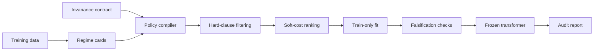

# NormSAT

NormSAT is a regime-aware normalization compiler for tabular machine learning.
Instead of picking one scaler by habit, it profiles each feature, checks an explicit
invariance contract, rejects unsafe transforms, and emits a frozen scikit-learn
transformer with an audit report.

The project is useful when different features need different normalization behavior:
sparse counts should keep zeros, signed features should keep signs, heavy-tailed
features may need robust scaling, and distance-sensitive models may need features to
be made more commensurate.

## Why It Exists

Classic normalization usually asks:

> Which scaler should I use?

NormSAT asks a stricter question:

> What nuisance variation must be removed, what signal must survive, and what is the
> least transform that satisfies those constraints?

That framing gives the transformer three practical properties:

- It is feature-aware: one table can compile to different transforms per column.
- It is contract-aware: hard requirements such as `preserve_zero` or
  `preserve_sign` reject incompatible policies.
- It is audit-friendly: fitted policies, rejected alternatives, falsification checks,
  and leakage guards are available after fitting.

## Workflow



## Installation

Clone the repository and install it in editable mode:

```bash
git clone https://github.com/harshad317/NormSAT.git
cd NormSAT
python3 -m pip install -e .
```

For development and tests:

```bash
python3 -m pip install -e ".[dev]"
python3 -m pytest -q
```

Optional neural-layer support requires PyTorch:

```bash
python3 -m pip install -e ".[torch]"
```

## Quickstart

```python
import numpy as np

from rancsat import InvarianceContract, RANCSATTransformer

rng = np.random.default_rng(0)
X = np.column_stack([
    rng.normal(10, 2, 500),                         # dense Gaussian feature
    np.where(rng.random(500) < 0.7, 0.0, rng.poisson(2, 500)),  # sparse counts
    np.exp(rng.normal(0, 1, 500)),                  # positive skew
])

contract = InvarianceContract(
    enforce_scale_invariance=True,
    preserve_zero=True,
)

norm = RANCSATTransformer(
    contract=contract,
    feature_names=["dense", "sparse_count", "positive_skew"],
)

Xt = norm.fit_transform(X)
print(Xt.shape)
print(norm.audit_report().summary())
```

Use it inside a scikit-learn pipeline:

```python
from sklearn.linear_model import LogisticRegression
from sklearn.pipeline import Pipeline

pipe = Pipeline([
    ("norm", RANCSATTransformer(contract=contract)),
    ("clf", LogisticRegression(max_iter=500)),
])

pipe.fit(X, y)
```

Because the transformer follows the scikit-learn estimator API, cross-validation
clones and fits it inside each training fold.

## Contracts

An `InvarianceContract` declares what the normalization step must preserve or remove.
Common options include:

| Contract option | Meaning |
| --- | --- |
| `enforce_scale_invariance` | Remove arbitrary feature scale. |
| `enforce_shift_invariance` | Remove arbitrary feature location. |
| `preserve_zero` | Keep structural zeros at zero. |
| `preserve_sign` | Do not flip signs. |
| `preserve_rank` | Use monotone transforms only. |
| `preserve_distance_ratios` | Restrict to affine-style transforms. |
| `damp_outliers` | Prefer policies robust to extreme values. |
| `preserve_extreme_signal` | Do not clip or flatten important extremes. |
| `allow_inverse_transform` | Require invertible policies. |
| `prefer_distribution_match` | Prefer rank or quantile matching for distance models. |

Example:

```python
contract = InvarianceContract(
    preserve_zero=True,
    preserve_sign=True,
    damp_outliers=True,
)
```

If the requested constraints conflict, NormSAT falls back conservatively and records
the unsatisfied clauses in the audit report.

## What Gets Compiled

The compiler chooses from a finite policy DSL, including:

- identity / no-op
- standard affine scaling
- robust affine scaling
- min-max scaling when bounds are declared semantic
- max-absolute and robust max-absolute scaling
- robust clipping
- signed log and `log1p`
- Box-Cox and Yeo-Johnson power transforms
- quantile uniform and quantile normal transforms
- optional whitening for reliable covariance regimes

Policies are selected per feature after hard constraint filtering and soft-cost
ranking. Transform parameters are fitted on the training data only.

## Audit Reports

After fitting, call `audit_report()`:

```python
report = norm.audit_report()
print(report.summary())
json_payload = report.to_json()
```

The report contains:

- fitted regime cards
- final policies
- rejected policies and reasons
- falsification results
- no-op fraction
- data hash
- split type
- leakage guard status

## Examples

Run the end-to-end demo:

```bash
python3 examples/demo.py
```

Run the test suite:

```bash
python3 -m pytest -q
```

Useful entry points:

- `examples/demo.py`: complete walkthrough
- `examples/run_ablation.py`: selector ablation
- `examples/run_all_experiments.py`: bundled experiment runner
- `examples/run_neural_eval.py`: optional neural-mode evaluation
- `examples/run_openml_at_scale.py`: OpenML-scale runner

## Neural Mode

NormSAT also includes an optional PyTorch layer, `RANCSATNorm`, that compiles a
normalization layer from a contract and an activation regime.

```python
import torch

from rancsat import InvarianceContract
from rancsat.torch_mode import ActivationRegime, RANCSATNorm

layer = RANCSATNorm(
    normalized_shape=256,
    contract=InvarianceContract(avoid_batch_dependence=True),
    regime=ActivationRegime(block="mlp", mean_is_signal=False),
)

y = layer(torch.randn(8, 256))
print(layer.extra_repr())
print(layer.stability_report())
```

## Package Layout

```text
rancsat/
  schemas.py        Core dataclasses, contracts, audit reports, policy enum
  profiling.py      Train-only regime-card construction
  contracts.py      Conservative per-feature contract derivation
  ledger.py         Signal-risk ledger construction
  policies.py       Policy capabilities, fitting, application, inversion
  compiler.py       Hard constraints, soft costs, policy compilation
  falsification.py  Empirical invariant checks
  sklearn.py        RANCSATTransformer
  torch_mode.py     Optional PyTorch normalization layer
  synthetic.py      Synthetic regimes with oracle policies
  ablation.py       Rule-based and CV-search baselines
  benchmark.py      Oracle and downstream benchmark harness
```

## Scope

NormSAT is intentionally transparent: the per-feature policy space is small and the
compiler uses exact Python enumeration rather than a heavyweight solver. The value is
in the constraint framing, policy audit trail, and leakage-safe transformer behavior.

The project is a research prototype. Validate contracts against your downstream model
and domain assumptions before relying on compiled policies in production.
